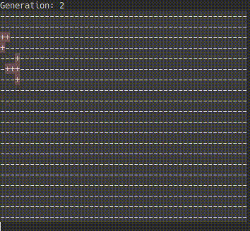

## Game of Life



#### Introduction
Citing wikipedia, _Game of Life_ is a cellular automation devised by John Conway
(1970).

In the simulation each point of a 2D grid represents a cell.  Each cell can have
two states: dead or alive.  The state of a cell depends on its neighbours, by
the following rules:
1. If a live cell has less than two live neighbours, it dies due to underpopulation
2. If a live cell has two or three live neighbours, it remains alive
3. If a dead cell has three live neighbours, it comes to life
4. If a live cell has more than three live neighbours, it dies due to overpopulation

#### How to run
The algorithm is implemented in C++, and the simulation is presented in
the terminal. It has been tested using the Guake and Xfce terminal emulators on
Ubuntu 18.04.
To check out the simulation, download the main file `gameOfLife.cpp`, and in its
directory run:
```bash
g++ source/gameOfLife.cpp && ./a.out
```
As far as I know there shouldn't be any dependency to compile and run the
program. The header files required to obtain the terminal size for fullscreen
mode might need to be changed for windows.

#### Implementation details
The boundaries of the grid are periodic, meaning that it loops around its
borders. For example, a group of living cells moving through the right border will
appear coming out from the left border. 
Scanning the layout of the current grid, the next generation is evaluated by going 
from cell to cell and counting its live neighbours. Then the updated grid replaces 
the previous one and gets printed on the screen.
If a stable generation is reached ( either because all cells are dead, or
because no new ones are produced) then the simulation terminates. The case of a
stable generation that includes oscillating groups does not cause termination.
